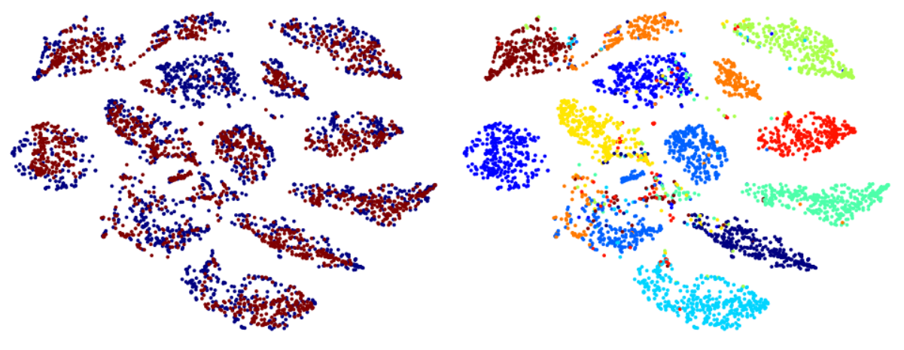

# Code
To conduct a full training simulation, use ``train.py``. This script calls the main script that establishes the network
and simulation through four parameters:
* <b>--method:</b> The method used to calculate the loss and optimize the model's parameters.
Currently there are four methods: Baseline, D-Coral, Log-D-Coral, and Entropy.
* <b>--alpha:</b> The alpha coefficient.
* <b>--sid:</b> The source ID.
* <b>--tid:</b> The target ID.
```
python3 train.py --method log-d-coral --alpha 100 --sid 3 --tid 11
```

* The script ``download.sh`` collects both MNIST and SVHN. Default downloaing directory is ``./``.
  ```
  sudo chmod a+x download.sh
  ./download.sh
  ``` 

* ``prepro.py`` converts all of the data in ``dataset`` to numpy files for training.
    The ``dataset`` directory must be of the following format:
    ```
    dataset
    ├── dataset_1
    │   ├── any_name.png
    │   └── ...
    ├── dataset_2
    │   └── ...
    └── ...
    ```
  To call this script, run `python3 prepro.py`. 

* ``model.py`` deploys the net and losses definitions and the training operations.

* ``solver.py`` defines the ``Solver`` class which does the actual training and testing

* ``main.py`` creates the net and launches the training/testing/plotting, acccording to the ``--mode`` options. 

    For example:
    ```
    python3 main.py --mode='train' --method='log-d-coral' --alpha=7. --device='/gpu:0'
    python3 main.py --mode='test' --method='log-d-coral' --alpha=7. --device='/gpu:0'
    python3 main.py --mode='tsne' --method='log-d-coral' --alpha=7. --device='/gpu:0'
    ```
NOTE: ``alpha`` replaces the ``lambda`` notation in the paper, in order to avoid confusion with the python ``lambda`` operator.
    
#### Tensorboard logs
For the training process above, logs are saved in ``./logs/log-d-coral/alpha_7.``. 

The command
 ```
 tensorboard --logdir logs
 ```
allows you to visualize all the logs in the ``log`` folder.

#### Visualizations

Below are the t-SNE visualization produced by the command above, showing the feature space learned by geodesic aligment. *Left*: blue and red dots indicate SVHN (source) and MNIST (target) features,respectively. *Right*: different colors indicate the ten different classes


